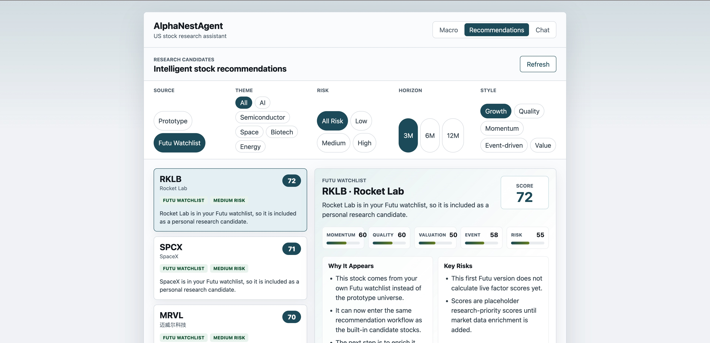
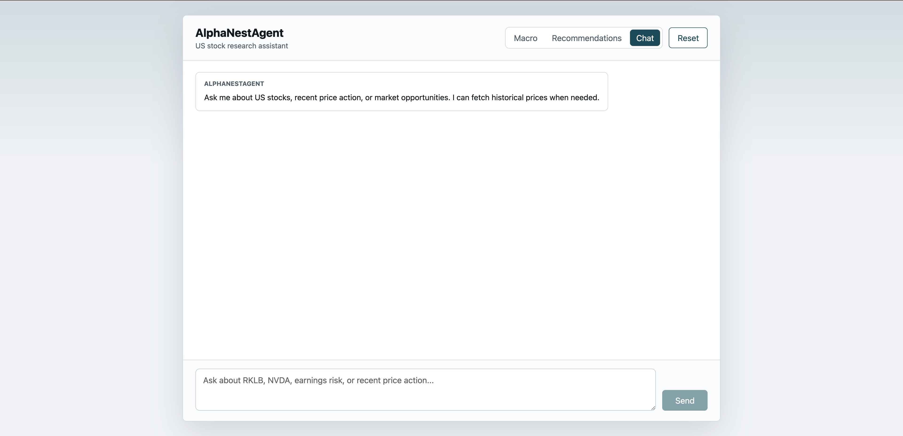
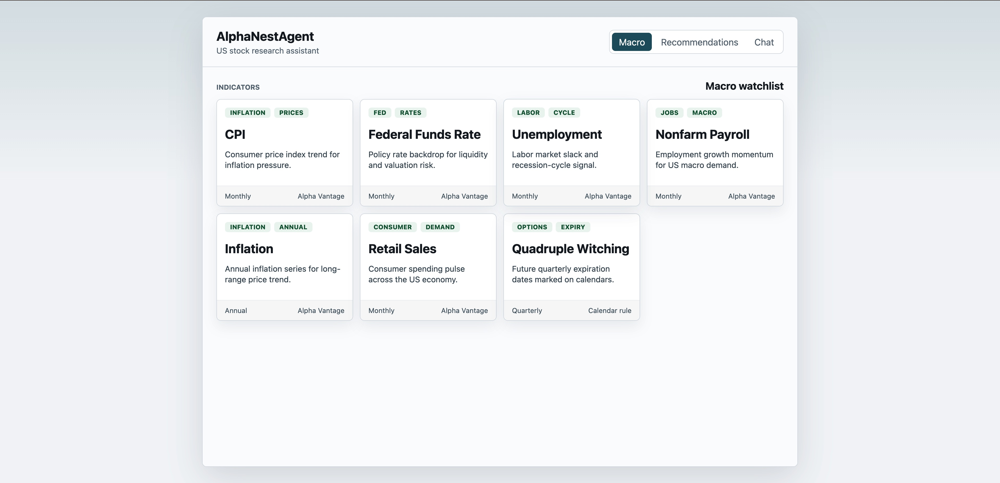
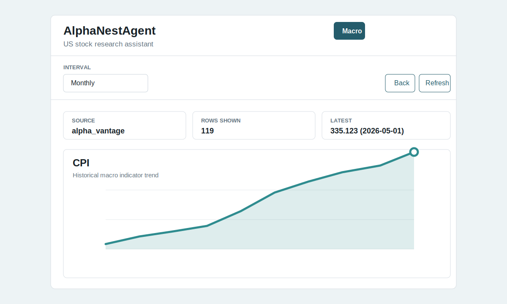

# AlphaNestAgent

AlphaNestAgent is an intelligent investment research agent for the U.S. stock market. It helps users discover potential market opportunities, track key events, and improve research efficiency with quantitative analysis capabilities.

## Interface Preview

### Futu Watchlist Recommendations



### Chat Assistant



### Macro Indicator Watchlist



### Macro Indicator Detail



## Key Features

1. Intelligent Stock Recommendations
   - Screens stocks with potential research value based on market data, company fundamentals, trending events, and user preferences.
   - Supports candidate stock lists across different sectors, themes, risk profiles, and investment horizons.
   - Can use a prototype recommendation universe or stocks from your Futu watchlist through Futu OpenD.

2. U.S. Market Opportunity Tracking for the Next Three Months
   - Tracks major events that may affect U.S. equity markets over the next three months.
   - Focuses on key macro and fundamental catalysts, including company earnings, Federal Reserve meetings, nonfarm payrolls, and PPI/CPI inflation data.
   - Helps identify potential event-driven opportunities, risk windows, and shifts in market sentiment.

3. Quantitative Analysis
   - Supports quantitative analysis based on historical prices, technical indicators, factor data, and strategy rules.
   - Can be used for strategy backtesting, signal generation, risk assessment, and portfolio screening.

## Application Views

- `Macro`: Browse macro indicators, open indicator details, and inspect line charts or event calendars.
- `Recommendations`: Review candidate stocks from either the built-in prototype universe or your Futu watchlist.
- `Chat`: Ask the research agent questions about U.S. stocks, market events, and price action.

## Development Setup

Install Python dependencies:

```bash
uv sync
```

Start the Python backend:

```bash
uv run python agent_web_api.py
```

The backend runs at:

```txt
http://127.0.0.1:8000
```

Start the React frontend:

```bash
cd frontend
npm install
npm run dev
```

The frontend usually runs at:

```txt
http://127.0.0.1:5173
```

## Futu OpenD Setup

AlphaNestAgent can read your Futu watchlist through Futu OpenD.

1. Start Futu OpenD.
2. Log in with your Futu account.
3. Keep OpenD listening on the default local address:

```txt
127.0.0.1:11111
```

If your OpenD host or port is different, configure:

```bash
FUTU_OPEND_HOST=127.0.0.1
FUTU_OPEND_PORT=11111
```

Then restart the backend:

```bash
uv run python agent_web_api.py
```

## API Endpoints

```txt
GET  /health
GET  /macro
GET  /recommendations
GET  /futu/watchlist
POST /chat
POST /reset
```

## Risk Disclaimer

The output of this project is for investment research and informational purposes only. It does not constitute financial advice. Stock market investing involves risk, and all investment decisions should be made independently based on personal risk tolerance.
